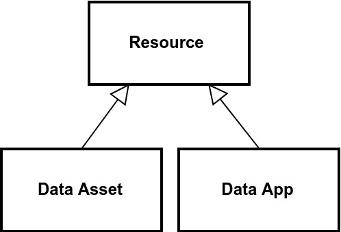

# Resource Model

`Resource` is the top level class of the hierarchy of digital assets comprising the `DataAsset` and `DatApp` subclasses.

<!---  --->
</img>

`Resource` content is modeled at 3 abstraction layers defined in the Reference Architecture Document v2:

1. Resource - abstract content
2. Representation - concrete content (syntax)
3. Artifact - materialization

<!---  --->
</img>

# References
- [Data Catalog Vocabulary (DCAT). W3C Recommendation 16 January 2014](https://www.w3.org/TR/vocab-dcat/)

# Related resources

Listing of auxiliary, informative resources.

## General dataset models
- [Dataset Descriptions: HCLS Community Profile. W3C Interest Group Note 14 May 2015](https://www.w3.org/TR/hcls-dataset/)
- [DDI RDF Vocabularies](http://www.ddialliance.org/Specification/RDF)
- [DDI 3.2 XML Schema Documentation (2014-02-05)](https://www.ddialliance.org/Specification/DDI-Lifecycle/3.2/XMLSchema/FieldLevelDocumentation/)

## Data structures
- [The Statistical Core Vocabulary (scovo)](http://sw.joanneum.at/scovo/schema.html), core statistical structures
- [Metadata Vocabulary for Tabular Data. W3C Recommendation 17 December 2015](https://www.w3.org/TR/tabular-metadata/), metadata for annotation of tabular data at various levels

## Data types, quantities, units etc.
- [Custom Datatypes. Towards a web of Linked Datatypes. Draft 20 March 2018](https://ci.mines-stetienne.fr/lindt/v2/custom_datatypes.html), specification of RDF datatypes for quantity value literals complaint with Code of Units of Measures [UCUM](https://ci.mines-stetienne.fr/lindt/v2/custom_datatypes.html#bib-UCUM)
- [Quantities, Units, Dimensions and Types (QUDT) Schema - Version 2.0](http://www.qudt.org/doc/2017/DOC_SCHEMA-QUDT-v2.0.html)
- [QUDT Schema for Datatypes - Version 2.0](http://www.qudt.org/doc/2017/DOC_SCHEMA-QUDT-DATATYPES-v2.0.html)
- [Meek, B.: A taxonomy of datatypes, 1994](https://dl.acm.org/citation.cfm?id=185042&dl=ACM&coll=DL)
- [ISO/IEC 11404, General Purpose Datatypes](http://standards.iso.org/ittf/PubliclyAvailableStandards/c039479_ISO_IEC_11404_2007%28E%29.zip)
- [Panov, L. Soldatova, and S. Dzeroski: OntoDT - Generic Ontology of Datatypes, 2014](https://www.sciencedirect.com/science/article/pii/S0020025515005800), [homepage](http://www.ontodm.com/doku.php?id=ontodt)

## Media
- [Ontology for Media Resources 1.0. W3C Recommendation 09 February 2012](https://www.w3.org/TR/mediaont-10/)

## Analysis and discussion
- [DXWG GitHub Wiki: Data aspects semantics](https://github.com/w3c/dxwg/wiki/Data-aspects---semantics) 

## Guidelines and methodolgies
- [Data on the Web Best Practices. W3C Recommendation 31 January 2017](https://www.w3.org/TR/dwbp/), best practices related to the publication and usage of data on the Web, making data discoverable and understandable by humans and machines
- [Spatial Data on the Web Best Practices. W3C Working Group Note 28 September 2017](https://www.w3.org/TR/sdw-bp/), best practices related to the publication of spatial data on the Web
- [SDMX Glossary](https://sdmx.org/wp-content/uploads/SDMX_Glossary_Version_1_0_February_2016.docx), concepts and related definitions used in structural and reference metadata of international organisations and national data-producing agencies
- [Modelling Statistical Domains in SDMX, Version 2.0, June 2018](https://sdmx.org/wp-content/uploads/Modelling-statistical-domains-in-SDMX-v2-201806.docx), guideline on design and creation of SDMX information model instances
- [Best Practices for Usage of DDI 3.2 and Future Versions](https://www.ddialliance.org/system/files/DDI%203.2%20Best%20Practices_0.pdf), guideline on identification etc.

## Data type

# Issues/Questions/Ideas

## Content type
- Consider conversion of ContentType`-Subclasses to instances (i.e. value set of `contentType` predicate)
- Consider provision of content type-related description templates, e.g. what are the appropriate "audio" vs. "document" metadata?
- Consider discussions on [`type of data`](https://github.com/w3c/dxwg/issues/64)
- DCMI Type vocabulary - http://dublincore.org/documents/dcmi-terms/#section-7
- ISO 19115 Scope Code vocabulary - http://registry.it.csiro.au/def/isotc211/MD_ScopeCode https://geo-ide.noaa.gov/wiki/index.php?title=ISO_19115_and_19115-2_CodeList_Dictionaries#MD_ScopeCode
- PARSE.Insight content-types recommended for Re3data - http://www.re3data.org/schema http://gfzpublic.gfz-potsdam.de/pubman/item/escidoc:1397899
- https://webgate.ec.europa.eu/CITnet/stash/projects/ODCKAN/repos/datacite-to-dcat-ap/browse/documentation/Mappings.md
-  intellectual resource types: http://id.loc.gov/vocabulary/marcgt.html
- Individual (Linked Data) URIs for DataCite resource types are available here: http://registry.it.csiro.au/def/datacite/resourceType

## Keyword
- Clarify range of `ids:keyword` (xsd:anyURI), compare: [dcat:keyword](https://www.w3.org/TR/vocab-dcat/#Property:dataset_keyword)

